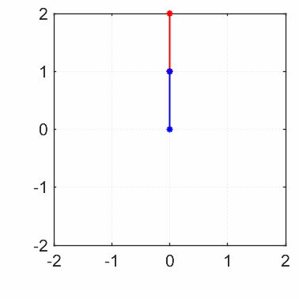

# Matlab-Code für SA-31
Dies ist der Matlab-Code für die Studienarbeit SA-31 mit dem Thema "Set-Membership Partikelfilter als Basis für robuste Regelungskonzepte"

| MPC mit Kenntnis der Messwerte | Min-Max-MPC mit Kenntnis der Messwerte | MPC mit Kenntnis der exakten Zustände |
:-------------------------:|:-------------------------:|:-------------------------:
  |    |  

Folgende Dateien/Ordner sind von Bedeutung:
- `ParticleFilter.m`: Implementierung der Partikelfilter-Algorithmen
- `PFAlgorithms.m`: Enumeration für die Partikelfilter-Algorithmen
- `PFOptions.m`: Optionen für die Partikelfilter-Algorithmen
- `MPC.m`: Implementierung der MPC und Min-Max-MPC
- `Grid.m`: Gitter für den "Redundancy Removal"-Partikelfilter
- `HyperRect.m`: Hyperrechtecke, aus denen das Gitter besteht
- `Paving.m`: Intervallüberdeckung (war für eine eigene SIVIA-Implementierung gedacht, wird nicht verwendet)
- `PF_vsivia.m`: Parameterklasse für die SIVIA-Implementierung
- `SIVIA_TS.m`: Skript mit SMF über den SIVIA-Algorithmus für das 2-dim. Testsystem
- `SIVIA_PS.m`: Skript mit SMF über den SIVIA-Algorithmus für das 4-dim. Pendelsystem/Ebener Manipulator
- `SIVIA_z.m`: Skript zur Rekonstruktion der Menge H über den SIVIA-Algorithmus
- `gurobi_linprog.m`: Skript für lineare Optimierung mit GUROBI
- `systems/`: Dynamische Systeme zum Testen
- `test/`: Verschiedene Testskripte
- `vsivia/`: Vektorisierte SIVIA-Implementierung
- `plots/`: Verschiedene Skripte zum Plotten und erstellte Plots

## Kurze Einführung
Generell müssen zur Ausführung in Matlab alle Unterverzeichnisse zum Pfad hinzugefügt werden. Aktuelles Verzeichnis sollte dieses Wurzelverzeichnis sein.

Ein Testskript für die Funktionsweise der MPC und Min-Max-MPC ist in `test/mpcTest.m`

Dabei wird ein System eines ebenen Manipulators mit direkter Zustandsmessung erstellt. Auf dieses System werden dann

- die MPC mit Kenntnis der Messwerte (`mpc0`),
- die Min-Max-MPC mit Kenntnis der Messwerte (`mpc1`) und
- die MPC mit Kenntnis der exakten Zustände (`mpc2`)

angewandt.

Ein mögliches Maß für die Regelgüte ist `Jreal` (MPC-Kostenfunktional in den Zustands-/Eingangstrajektorien des geschl. Kreises ausgewertet).

Eine Animation des geregelten Systems kann z.B. mit `mpc1.system.animation()` erstellt werden.

- - - - - - - - - - - - - - - - - - - - - - - - - - - - - - -

Letzte Änderung am 26.04.2021

Julius Herb (st160887@stud.uni-stuttgart.de)
